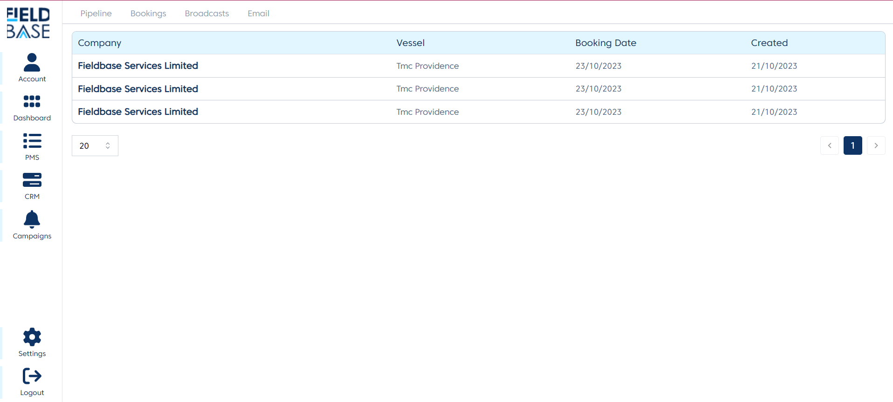
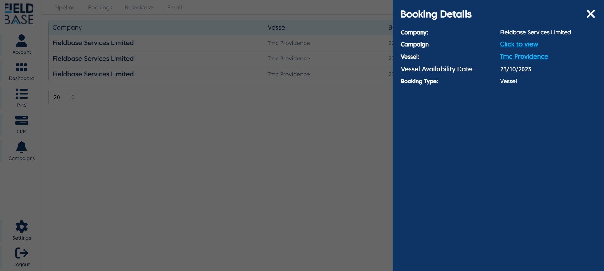

# Bookings

## Overview

This page lists out bookings made by the clients as a result of the emails they got from the system.

## Booking Detail

To view the booking detail, click the name of the company.

The details of the booking include the:

- **Vessel**
- **Campaign**: This is the campaign of the email of the upcoming service that the Client booked from.
- **Booking Type**: This would the either Vessel/Equipment Booking Type
- **Vessel Availability Date**: This is the date that the vessel will be available for our engineers to work on it.
