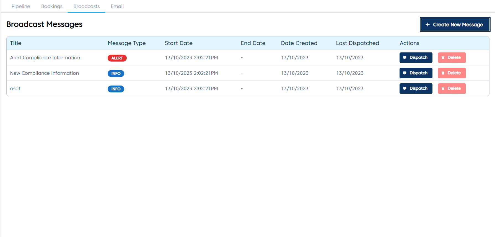
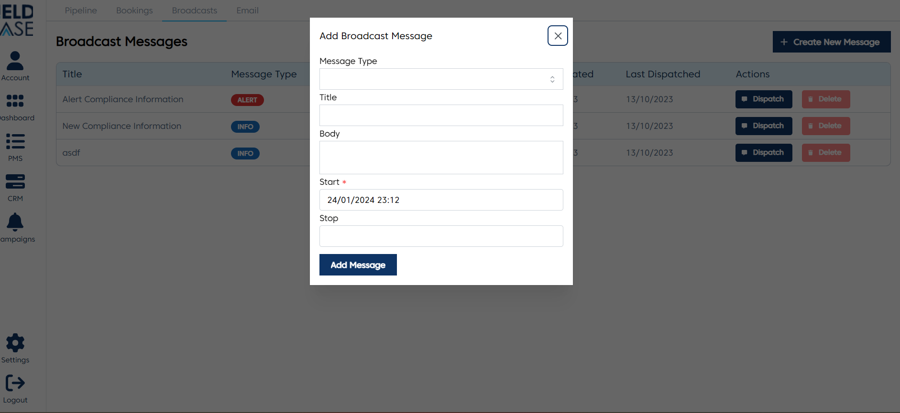

# Broadcast Messages

## Overview

This module is used to send broadcast messages to all clients. These messages are sent using websockets for clients that are logged in. If they are not logged at the time of the message broadcast, they will be greeted with the message as a notification pop up when they sign in.

## Create a new broadcast message

- Click on the Create New Message button
- Select the message type. It is either an info(ℹ️) message or alert(⚠️) message
- Enter the message title.
- Enter the message body
- Enter a message start date. This part is mandatory
- Enter a message end date (optional). If this is entered, once that time passes, the clients who have not view the message by the time the end date has elapsed won't be greeted with the message when the signed in.

## Manually dispatch a message

You can manually dispatch a message whether the start time has arrived or whether the end time has elapsed. Just click the the dispatch button for the message you want to dispatch, and the message gets dispatched.

## Delete a broadcast message

To delete a broadcast message, just click the delete button of the message that you want to delete.
