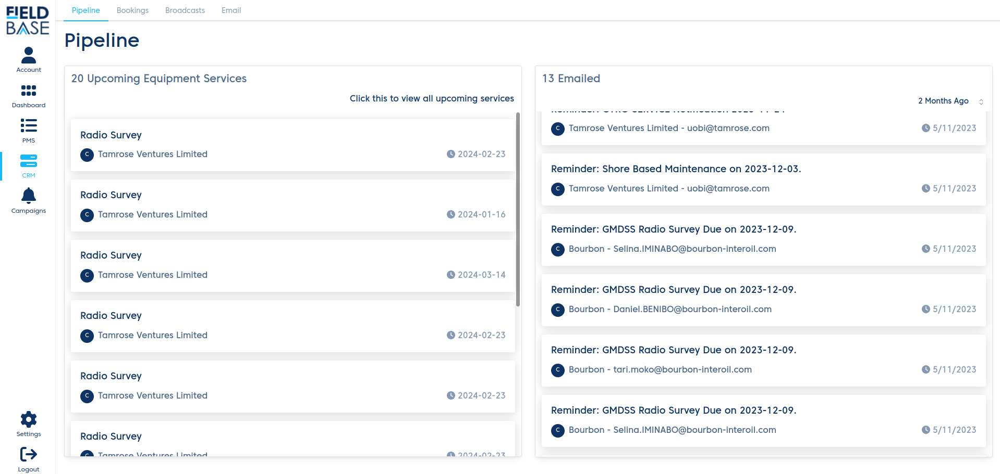

# CRM

This module has a list of submodules that handles the piplines for the E-PMS

- [Pipeline](/crm-modules/pipeline.md)
- [Bookings](/crm-modules/bookings.md)
- Broadcasts
- [Email](/crm-modules/email.md)

The Pipeline page has 2 lists. One being a list of latest upcoming equipment services, and the other being the list of emails sent out by the E-PMS

