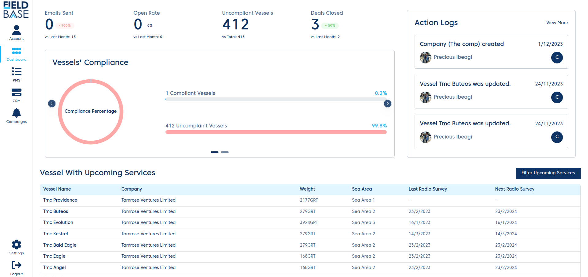
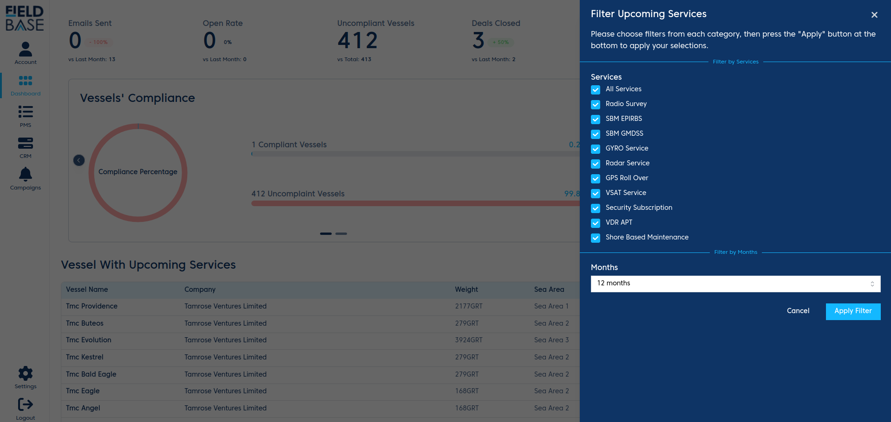

# Dashboard

Let's talk about the **E-PMS Dashboard**

## Dashboard

The dashboard is the first place you see when you first login to the E-PMS.

At the top of the page you see some metrics.

- **Email Sent**: Number of e-mails sent in current month VS previous month.
- **Open Rate**: Number of e-mail open rate in current month VS previous month.
- **Uncompliant Vessels vs Total**: Number of compliant vessels VS total vessels.
- **Deals Closed**: Number of deals in current month VS previous month.

You see a chart below the top metrics. This chart shows the percentage of Compliant vessels in the system.

At the right hand side, you can see a summary of the action logs on the system. Action logs are a record of every mutating action that everyone takes on the E-PMS.

Below is a list of all the vessels that have upcoming services on the E-PMS. This list can be filtered using services and month.

