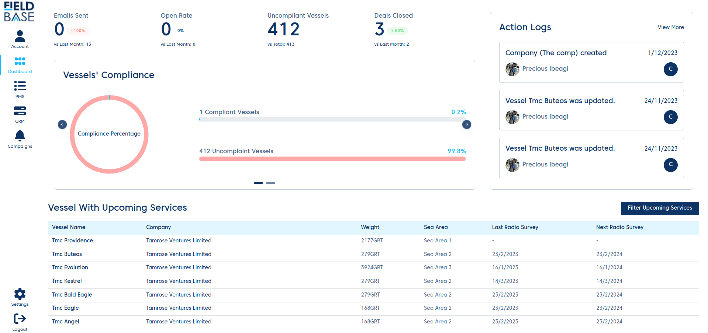

# Introduction

The Fieldbase Electronic Planned Maintenance System (E-PMS) is a simple but powerful centralized system for vessel owners to keep track of their vessel and vessel equipment to make sure that they are compliant with regulations.

The application comes with several modules.

- [DASHBOARD](/docs/guide/Dashboard.md)
- [CRM](/docs/guide/CRM.md)
- [PMS](/docs/guide/PMS.md)
- PIPELINE
- SETTINGS
- PROFILE
- ACTION LOGS
- CAMPAIGN
- SETTINGS
