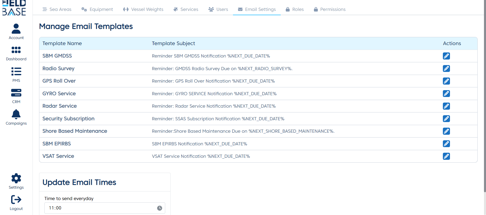
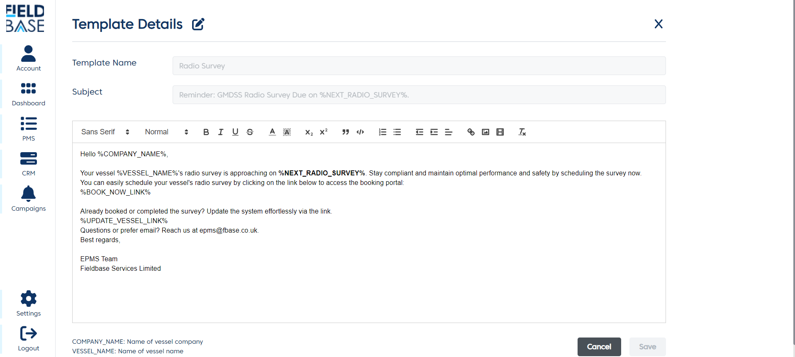
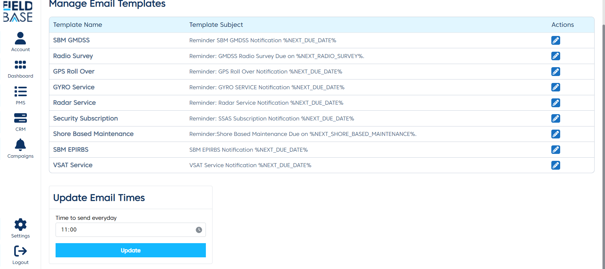

# Email Settings

## Overview

This is a module that let's you manage email templates and to set the time when the emails should be dispatched everyday.

## Manage email templates

There is a list of email templates already listed in the system. These cannot be deleted and new ones cannot be added. **To get other email templates added, contact the developers**.

## Edit an email template

To edit an email template:

- locate it on the list of email templates.
- Click the edit button and you will be taken to a template detail modal.

- Click on the edit button next to the `Template Details` text.
- When you are done click the save button.

## Template Placeholders

In the email templates there are certain placeholder to be aware of. A placeholder is any text or group of texts that is encapsulated it the `%` sign, i.e `%RADIO_SURVEY%`. A placeholder is processed by the E-PMS and an appropriate result is put in the message.

Below is a list of available placeholders and what they result in the E-PMS:

1. **VESSEL_NAME**: This is the name of the vessel to which the upcoming service belongs to.
2. **RADIO_SURVEY**: This is the date of next radio survey. (N.B Shoud only be used in the **Radio Survey** template).
3. **NEXT_SHORE_BASED_MAINTENANCE**: This is the date of next shore based maintenance. (N.B Shoud only be used in the **Shore Based Maintenance** template).
4. **COMPANY_NAME**: This is the name of the company to which the upcoming service belongs to.
5. **EQUIPMENT_NAME**: This is the name of the equipment that to which the upcoming service belongs to. **(If it is an equipment Service)**
6. **NEXT_DUE_DATE**: This is the date of next due date of an upcoming service. This is used when the upcoming service is not a **vessel service**.
7. **BOOK_NOW_LINK**: This is a link that takes the client to a page where they can book maintenance for the upcoming service.
8. **UPDATE_VESSEL_LINK**: This is a link that takes the client to a page for them to update their vessel in the case when they already booked or completed the survey.

## Update Email Times

This will help you to set the time when emails should be dispatched everyday.

