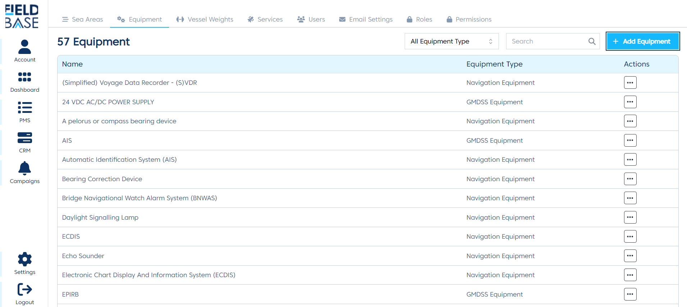
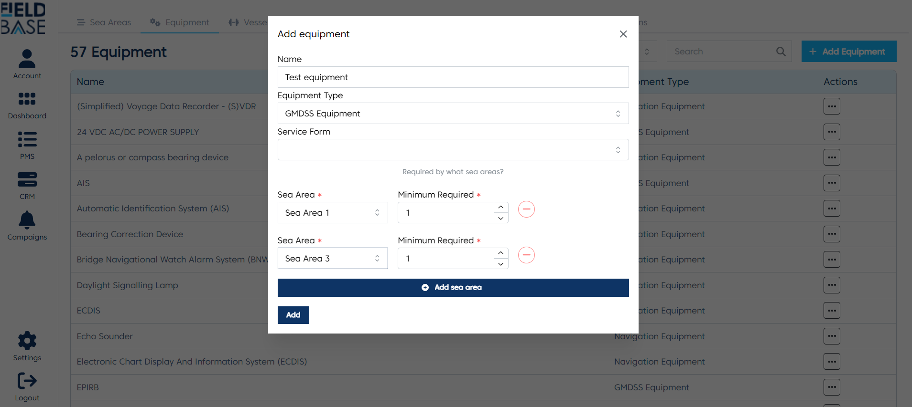
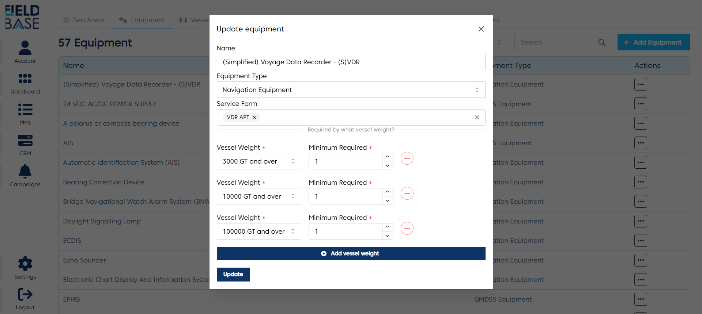
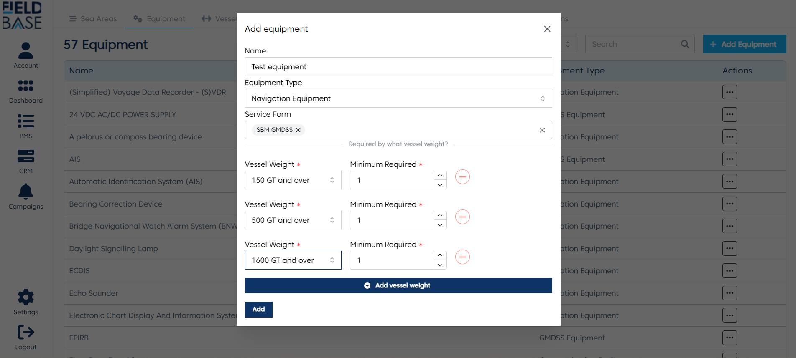

# Equipment Settings

## Overview

This is a place to module to manage all the equipment that equipment in the system. After these equipment are added to the system, they can be attached to a vessel.

## Add an equipment

To add an equipment to the system:

- Click the add equipment button
- Enter the equipment name
- Select the [equipment type](#equipment-types)
- Select the [service forms](#service-forms)
- Click the `Add` button to save.

## Edit an equipment

To edit an equipment to the system:

- Click the edit equipment button
- Enter the equipment name
- Select the [equipment type](#equipment-types)
- Select the [service forms](#service-forms)
- Click the `Update` button to save.

## Service Forms

These are the forms that appear in the vessel equipment details page. They are the forms used to set up the upcoming services of an equipment.

## Equipment Types

There are conditional fields that appear based on some equipment types. These fields are used to set the amount of an equipment that should be in a vessel based on sea area or vessel weight.

Below are a list of Eqiupment type that have conditional fields:

- **GMDSS Equipment**: When this equipment type is selected, you are asked what sea areas it is required in. Click the `add to sea area` button. Select the sea area and enter the numbers required for that sea area.

- **Navigation equipment**: When this equipment type is selected, you are asked what vessel weight it is required in. Click the `add vessel weight` button. Select the vessel weight and enter the numbers required for that vessel weight
