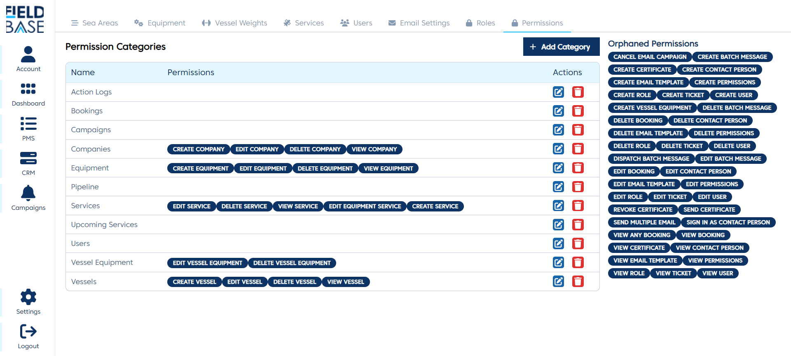
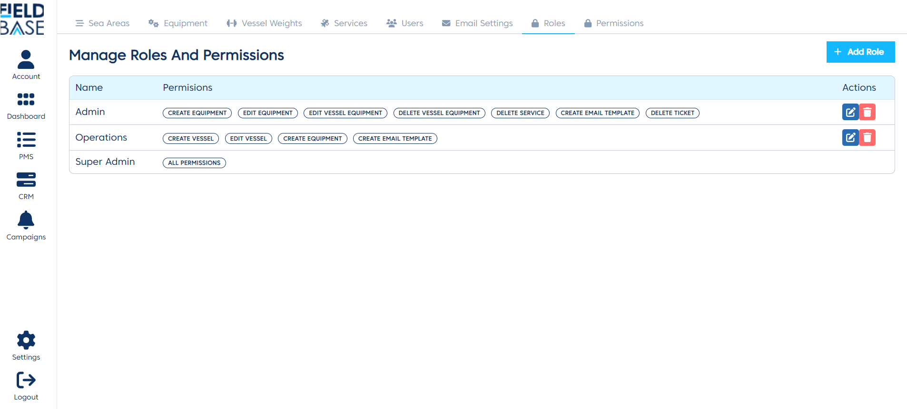

# Role and permissions

## Overview

You can setup your roles and permissions using this module.

## Permissions

This setting tab is used to categorize the role permissions. If the permission do not have category, they are marked as **orphaned**.
You can add and edit the categoies.

## Roles

This tab is used to manage roles an attach permissions to the roles.

### Add a role

To add a role:

- Click the `Add Role` button.
- Enter the role name
- Click of the role permission categories and tick the permission you want to attach to the role.
- Click the `Save Role` button to save.

### Edit Role

To edit a role:

- Click the edit button for the role you want to change.
- Edit the name if needed.
- Click of the role permission categories and tick the permission you want to attach to the role.
- Click the `Save Role` button to save.

### Delete Role

To delete a role just click the delete button of the role you want to delete. Click the `Yes, delete` button on the pop up of the confirmation modal.
