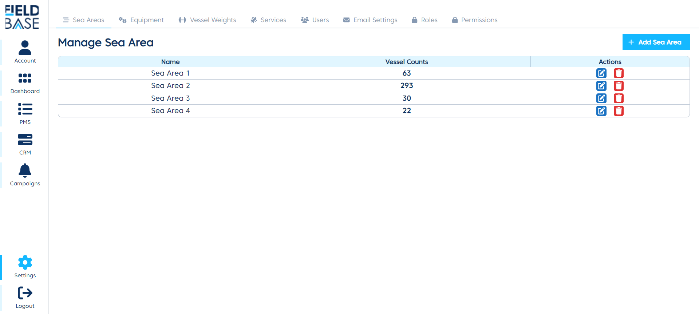
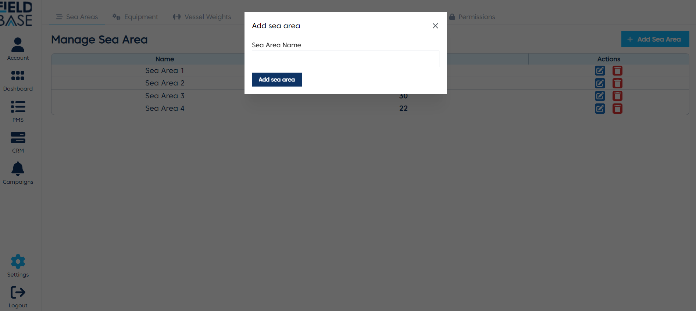
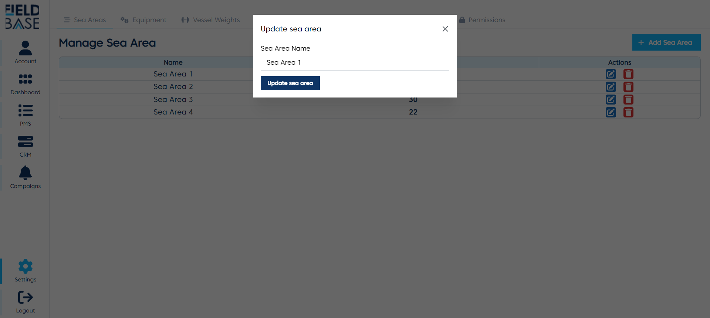
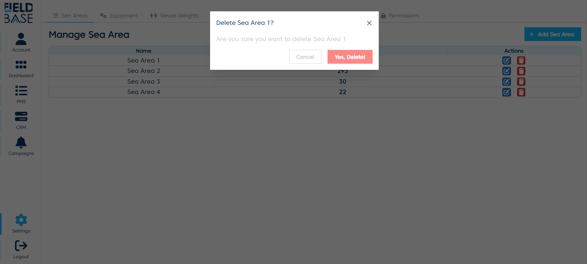

# Sea Area Settings

## Overview

This is a page where you can manage the sea areas of the vessels.

## Add a Sea Area

To add a sea area:

- Click the `Add Sea Area` button
- Enter the sea area name
- Click the `Add Sea Area` button to submit

## Edit a Sea Area

To edit a sea area:

- Local the sea area you want to edit.
- Click the edit button.
- Edit the sea area name.
- Click the `Update Sea Area` button to submit.

## Delete Sea Area

To delet a sea area, just locate the sea area on the list and click the delete button. And click the yes button when prompted with the confirmation modal.
