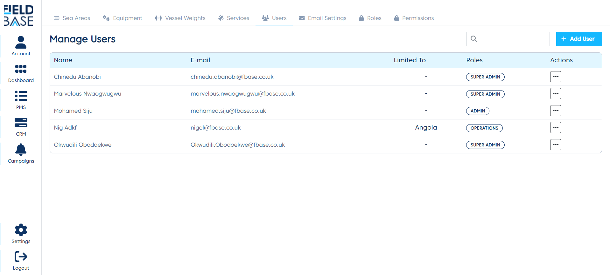
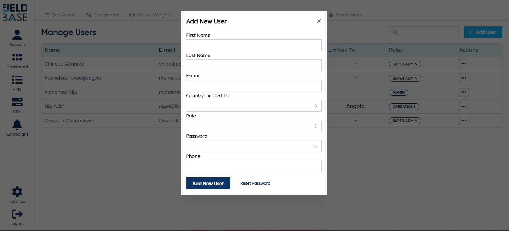
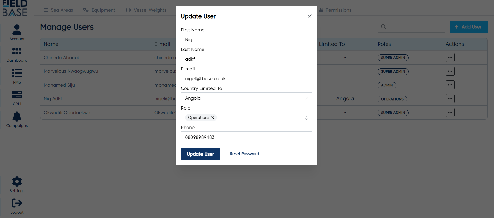
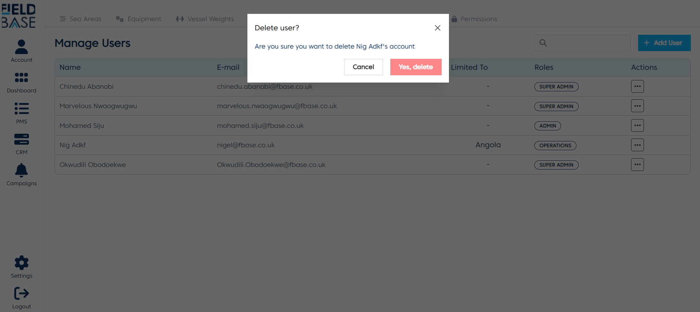

# Manage Users

## Overview

This is a module that lets you manage the users on the E-PMS.

## Add a user

To add a user:

- Click the `Add User` button.
- Enter the first name.
- Enter the last name.
- Enter the email.
- If you want to limit the user to items from Nigeria/Angola, select the `Country Limited To`.
- Select the role for the user.
- Enter the user password.
- Enter the user phone number.
- Click the `Add User` button.

## Edit a user

To edit a user:

- Locate the user you want to edit. Click the action dropdown menu and select the `Edit` button.
- Edit the details
- Click the `Update User` button to save.
- If you need to reset the user's password, click the `Reset Password` button. Then enter the new password. Then click the `Reset Password` button to reset the password

## Delete a user

To delete a user:

- Locate the user you want to delete. Click the action dropdown menu and select the `Delete` button.
- Confirm the deletion by clicking the `Yes, delete` button.
