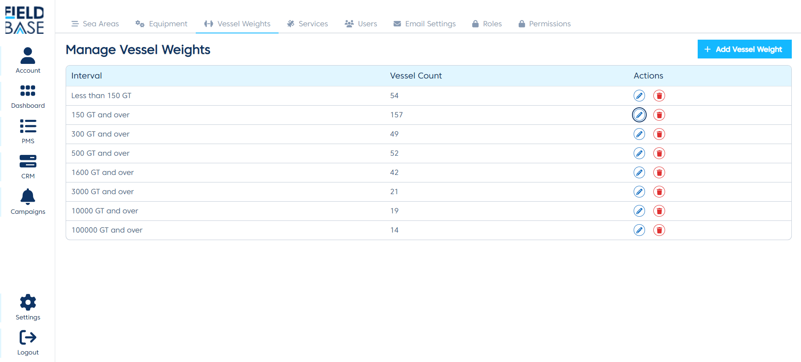
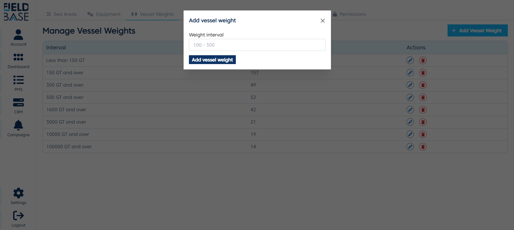
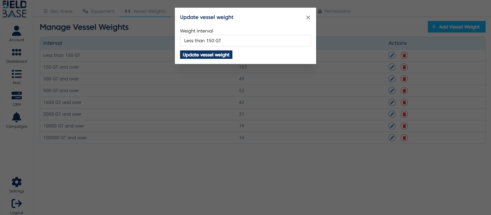
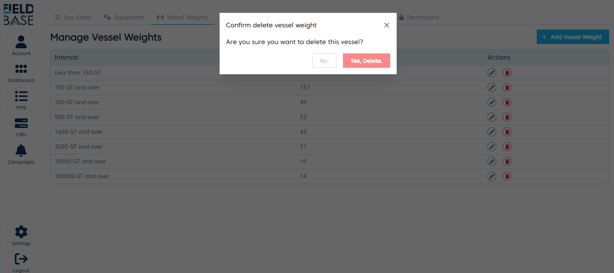

# Vessel Weight Settings

## Overview

This is a page where you can manage the vessel weights.

## Add a Vessel weight

To add a vessel weight:

- Click the `Add Vessel` button
- Enter the vessel weight name
- Click the `Add Vessel weight` button to submit

## Edit a Vessel weight

To edit a vessel weight:

- Local the vessel weight you want to edit.
- Click the edit button.
- Edit the vessel weight name.
- Click the `Update Vessel weight` button to submit.

## Delete Vessel weight

To delete a vessel weight, just locate the vessel weight on the list and click the delete button. And click the yes button when prompted with the confirmation modal.
